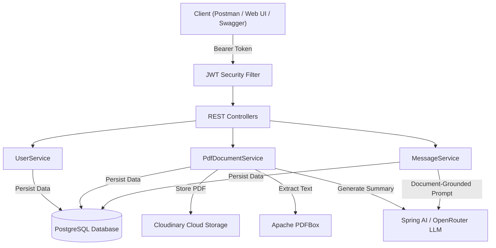

# SecondBrain

SecondBrain is a Spring Boot backend application designed for managing personal document knowledge bases, uploading PDFs to Cloudinary, and performing document-grounded question answering (RAG) using Spring AI and LLMs.

---

## Project Status & Overview

Status: Completed core backend features.

Key Accomplishments:
- Document-Grounded Q&A (RAG): Extracted text from uploaded PDFs using Apache PDFBox and passed context to LLMs via Spring AI, enabling accurate document-based answers.
- Cloud Storage Integration: Cloudinary API integration for remote PDF file storage.
- Stateless JWT Security: Spring Security configuration with BCrypt password hashing, JWT generation, and request filter chain.
- Structured Exception Handling: Standardized JSON error responses across all REST controllers.
- Interactive API Documentation: OpenAPI / Swagger UI integrated at /swagger-ui.html with Bearer Token authentication support.
- Automated Test Suite: Unit and integration tests using Mockito and an H2 in-memory test profile.

---

## Features

- Document Knowledge Base: Upload PDFs directly to Cloudinary with text extraction via Apache PDFBox.
- Document-Grounded Q&A: Ask questions against specific uploaded documents grounded in extracted text context.
- AI Summaries: Auto-generate concise summaries upon document upload.
- JWT Authentication & Security: Stateless authentication with Spring Security and BCrypt password encoding.
- Interactive API Documentation: Embedded Swagger UI at /swagger-ui.html with Bearer Token support.
- Structured Error Handling: Global exception handler returning standardized JSON error responses.

---

## Tech Stack

- Language: Java 17
- Framework: Spring Boot 3.5.x
- AI Integration: Spring AI (OpenAI / OpenRouter API)
- Database: PostgreSQL & Spring Data JPA (Hibernate)
- Storage: Cloudinary SDK
- Security: Spring Security & JWT (io.jsonwebtoken)
- Document Processing: Apache PDFBox 3.x
- Documentation: Springdoc OpenAPI / Swagger UI
- Testing: JUnit 5, Mockito, H2 Database
- Build Tool: Apache Maven

---

## Architecture Overview



---

## API Endpoints

### Authentication & Users
| Method | Endpoint | Description | Auth Required |
| --- | --- | --- | --- |
| POST | /api/users/register | Register a new user | No |
| POST | /api/users/login | Authenticate user & receive JWT token | No |
| GET | /api/users/{id} | Get user details by ID | Yes |
| GET | /api/users | List all registered users | Yes |

### PDF Document Management
| Method | Endpoint | Description | Auth Required |
| --- | --- | --- | --- |
| POST | /api/document/uploadDocument/{userId} | Upload PDF, extract text, upload to Cloudinary & summarize | Yes |
| GET | /api/document/{id} | Get PDF document metadata | Yes |
| GET | /api/document/user/{userId} | List all PDF documents uploaded by user | Yes |
| DELETE | /api/document/{id} | Delete a PDF document | Yes |

### Chat Sessions & AI Q&A
| Method | Endpoint | Description | Auth Required |
| --- | --- | --- | --- |
| POST | /api/chats | Create a new chat session for a PDF document | Yes |
| GET | /api/chats/{id} | Retrieve chat session details | Yes |
| POST | /api/messages/askQuestion | Ask a question grounded in the document context | Yes |
| GET | /api/messages/session/{sessionId} | Get message history for a chat session | Yes |

---

## Sample API Payloads

### 1. User Login (POST /api/users/login)
Response (200 OK):
```json
{
  "token": "eyJhbGciOiJIUzI1NiJ9.eyJzdWIiOiJzaGl2YW5zaCIsImlhdCI6MTY3ODkwMTIzNCwiZXhwIjoxNjc4OTg3NjM0fQ...",
  "userId": 1,
  "username": "shivansh",
  "email": "shivansh@example.com"
}
```

### 2. Document Upload (POST /api/document/uploadDocument/1)
Response (201 Created):
```json
{
  "id": 1,
  "fileName": "resume_guide.pdf",
  "filePath": "https://res.cloudinary.com/dbsbo10z0/raw/upload/v1700000000/resume_guide.pdf",
  "userId": 1,
  "summary": "This document outlines key technical skills and project structures for software engineering roles."
}
```

### 3. Ask Question (POST /api/messages/askQuestion)
Request:
```json
{
  "chatSessionId": 1,
  "question": "What are the key technical skills mentioned in the document?"
}
```

Response (200 OK):
```json
{
  "id": 1,
  "chatSessionId": 1,
  "question": "What are the key technical skills mentioned in the document?",
  "answer": "Based on the document context, the key technical skills mentioned are Java, Spring Boot, REST APIs, and PostgreSQL.",
  "createdAt": "2026-10-01T06:45:00"
}
```

---

## Setup & Running

### Prerequisites
- Java 17 or higher
- Maven 3.8+
- PostgreSQL Database

### Environment Configuration
Create a `.env` file in the root directory with the following variables:

```env
DB_USER=postgres
DB_PASSWORD=your_postgres_password
OPENROUTER_API_KEY=your_openrouter_api_key
CLOUDINARY_USER=your_cloudinary_cloud_name
CLOUDINARY_API=your_cloudinary_api_key
CLOUDINARY_API_SECRET=your_cloudinary_api_secret
JWT_SECRET=your_generated_jwt_secret_key
JWT_EXPIRATION=86400000
```

### Build & Execution

1. Clone the repository:
   ```bash
   git clone https://github.com/Shivansh1211/SecondBrain.git
   cd SecondBrain/SecondBrain
   ```

2. Build and run unit tests:
   ```bash
   mvn clean compile test
   ```

3. Run the application:
   ```bash
   mvn spring-boot:run
   ```

4. Swagger Documentation:
   Access interactive API docs at http://localhost:8080/swagger-ui.html