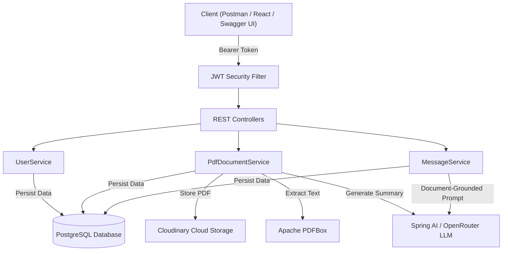

# SecondBrain 🧠

SecondBrain is a high-performance Spring Boot AI backend system designed for managing document knowledge bases, uploading PDFs to Cloudinary, and performing AI-driven, document-grounded question answering (RAG) using Spring AI and LLMs.

---

## 🚀 Features

- **Document Knowledge Base**: Upload PDFs directly to Cloudinary with text extraction via Apache PDFBox.
- **Document-Grounded Q&A (RAG)**: Ask questions against specific uploaded documents. The AI grounds its responses strictly in the extracted document context.
- **Interactive AI Summaries**: Auto-generate concise summaries upon document upload.
- **JWT Authentication & Security**: Stateless authentication with Spring Security and BCrypt password encoding.
- **Interactive API Documentation**: Embedded Swagger UI at `/swagger-ui.html` with Bearer Token Authorization support.
- **Structured Error Handling**: Global exception handler returning standardized RFC 7807 compliant error responses.

---

## 🛠️ Tech Stack

- **Language**: Java 17
- **Framework**: Spring Boot 3.5.x
- **AI Integration**: Spring AI (OpenAI / OpenRouter API)
- **Database**: PostgreSQL & Spring Data JPA (Hibernate)
- **Storage**: Cloudinary SDK
- **Security**: Spring Security & JWT (io.jsonwebtoken)
- **Document Processing**: Apache PDFBox 3.x
- **Documentation**: Springdoc OpenAPI / Swagger UI
- **Build Tool**: Apache Maven

---

## 📐 Architecture Overview



---

## 📋 API Endpoints

### Authentication & Users
| Method | Endpoint | Description | Auth Required |
| --- | --- | --- | --- |
| `POST` | `/api/users/register` | Register a new user | ❌ |
| `POST` | `/api/users/login` | Authenticate user & receive JWT token | ❌ |
| `GET` | `/api/users/{id}` | Get user details by ID | ✅ |
| `GET` | `/api/users` | List all registered users | ✅ |

### PDF Document Management
| Method | Endpoint | Description | Auth Required |
| --- | --- | --- | --- |
| `POST` | `/api/document/uploadDocument/{userId}` | Upload PDF, extract text, upload to Cloudinary & summarize | ✅ |
| `GET` | `/api/document/{id}` | Get PDF document metadata | ✅ |
| `GET` | `/api/document/user/{userId}` | List all PDF documents uploaded by user | ✅ |
| `DELETE` | `/api/document/{id}` | Delete a PDF document | ✅ |

### Chat Sessions & AI Q&A
| Method | Endpoint | Description | Auth Required |
| --- | --- | --- | --- |
| `POST` | `/api/chats` | Create a new chat session for a PDF document | ✅ |
| `GET` | `/api/chats/{id}` | Retrieve chat session details | ✅ |
| `POST` | `/api/messages/askQuestion` | Ask a question grounded in the document context | ✅ |
| `GET` | `/api/messages/session/{sessionId}` | Get message history for a chat session | ✅ |

---

## ⚡ Getting Started

### Prerequisites
- **Java 17** or higher
- **Maven 3.8+**
- **PostgreSQL Database** running locally or via Docker

### Environment Setup
Create a `.env` file in the project root directory with the following configuration:

```env
DB_USER=postgres
DB_PASSWORD=your_postgres_password
OPENROUTER_API_KEY=your_openrouter_or_openai_api_key
CLOUDINARY_USER=your_cloudinary_cloud_name
CLOUDINARY_API=your_cloudinary_api_key
CLOUDINARY_API_SECRET=your_cloudinary_api_secret
JWT_SECRET=5367566B59703373367639792F423F4528482B4D6251655468576D5A71347437
JWT_EXPIRATION=86400000
```

### Running the Application

1. **Clone the Repository**:
   ```bash
   git clone https://github.com/Shivansh1211/SecondBrain.git
   cd SecondBrain/SecondBrain
   ```

2. **Build and Test**:
   ```bash
   mvn clean compile test
   ```

3. **Run Application**:
   ```bash
   mvn spring-boot:run
   ```

4. **Access Interactive Swagger Documentation**:
   Navigate to [http://localhost:8080/swagger-ui.html](http://localhost:8080/swagger-ui.html) to explore and test the endpoints!
